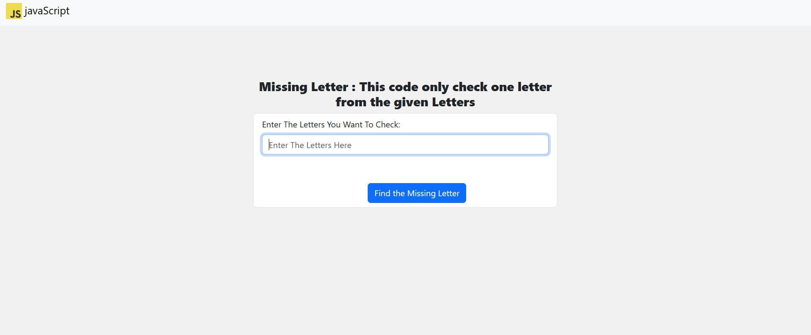
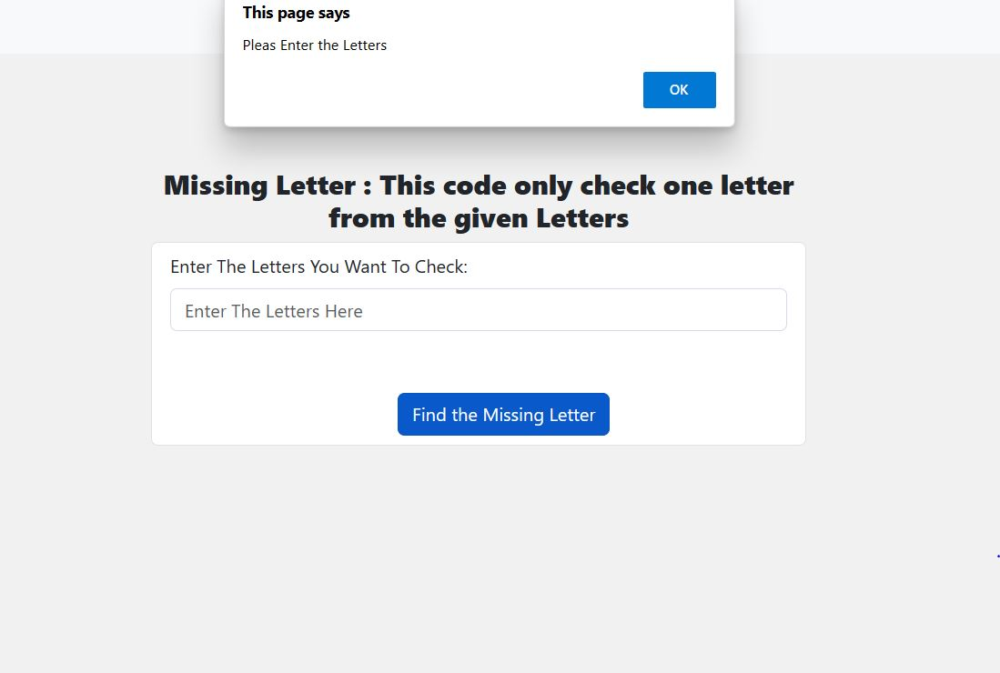
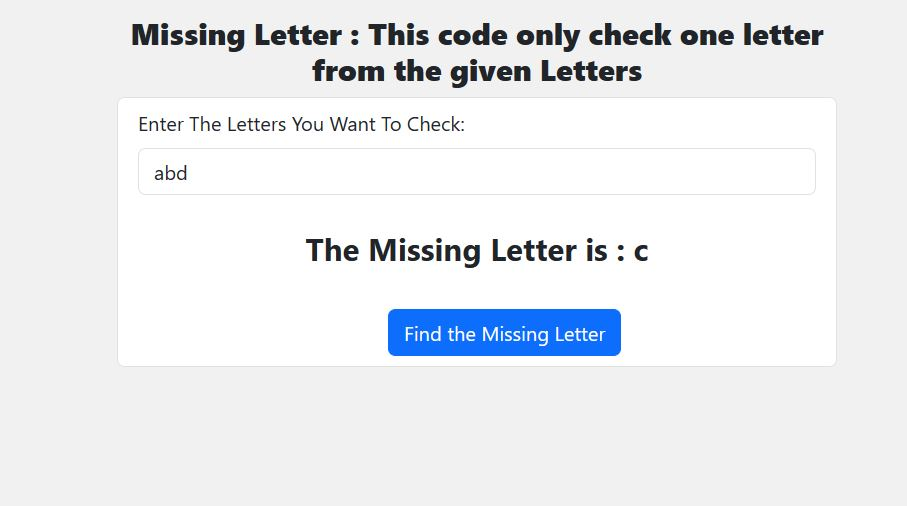

# Missing Letter Project

This Missing Letter project is built using HTML, CSS and JavaScript.

let me tell you the logic we used in the javaScript part First we define variables to store the character code for the first letter in the string, and to store whatever missing letter we may find.
We turn the string to an array in order to forEach through it instead of using for and while loops.
As we forEach through our letters’ character codes, we go comparing with the one that should be in that position.
If the current letter matches, we move the comparison variable to its next position so we can compare on the next cycle.
If not, the missing letter will be assigned to the missing variable, which will be returned after the map is finished.
If there are no missing characters, return undefined.

